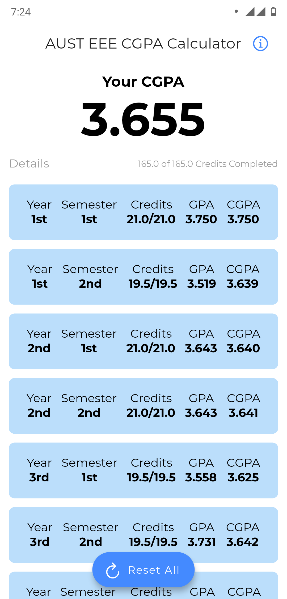
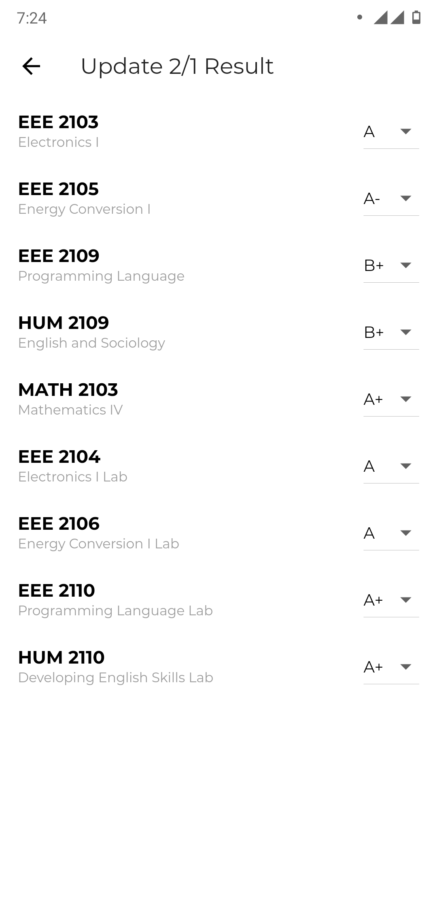
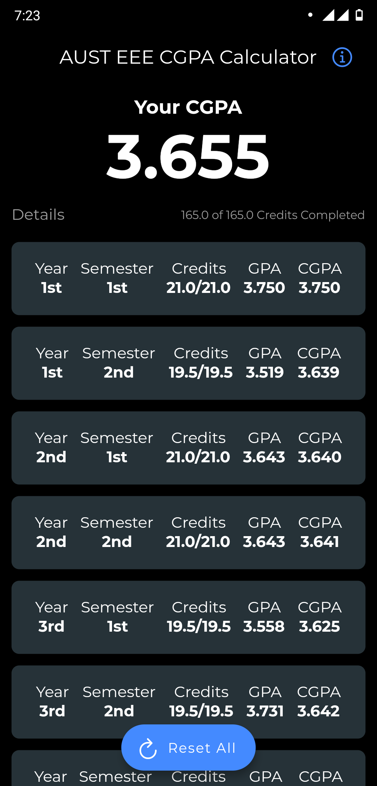
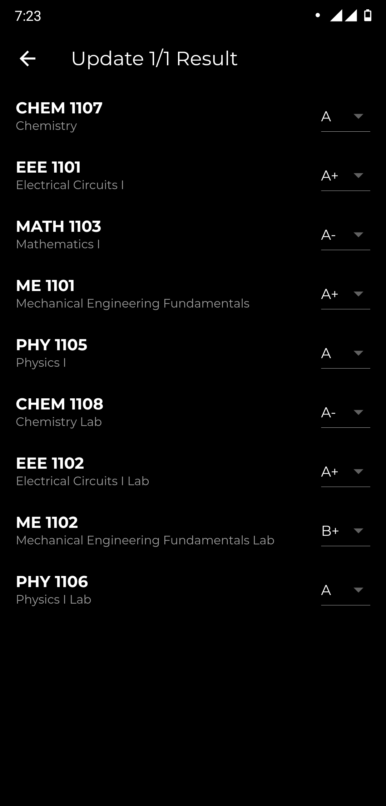

# AUST EEE CGPA Calculator v1.0.0
A simple CGPA Calculator android application based on AUST EEE curriculum 2013.

## Minimum Requirement
- Android 5.0 Lollipop (API level 21)

## Download
You can download the **Android App** for your device from **Releases** tab or by visiting [here](https://github.com/arnobk/AUST-EEE-CGPA-Calculator/releases).

## Features
- Offline Database.
- Light and Dark Theme.

## Screenshots
#### Light Theme

    
    

#### Dark Theme

    
    

## Issues/Feature Requests
If you find any bug then please create an issue. Same for feature requests. 

## Changelog
v1.0.0 (22 Jan 2021)
- Initial Release
